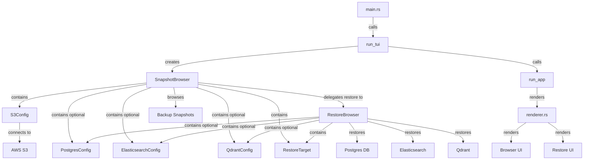
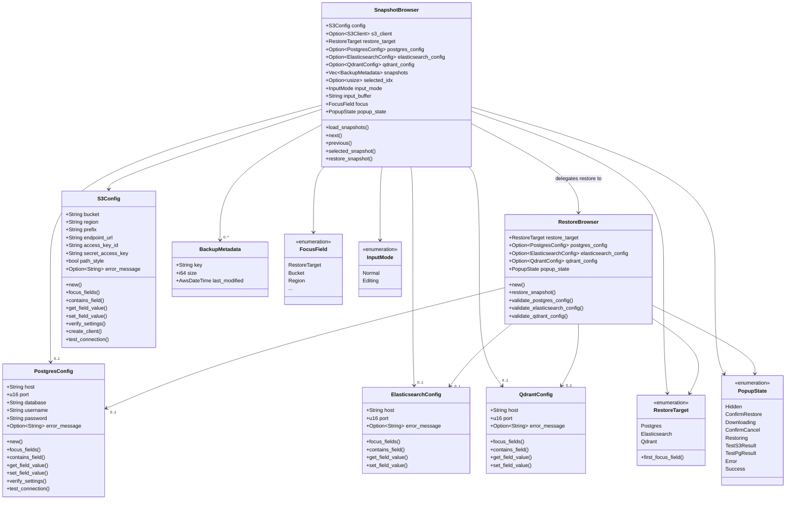
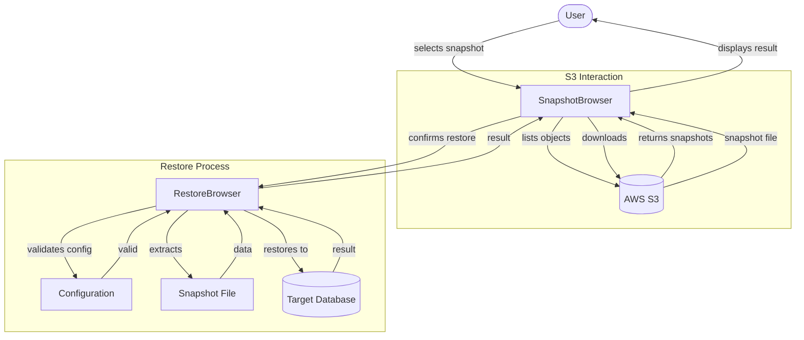
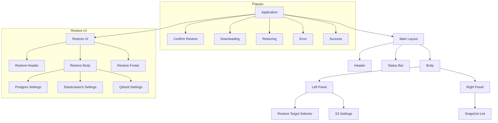

# Rustored Code Structure Diagram

## Component Relationships

```mermaid
graph TD
    Main[main.rs] --> |calls| RunTUI[run_tui]
    RunTUI --> |creates| Browser[SnapshotBrowser]
    RunTUI --> |calls| RunApp[run_app]
    
    Browser --> |contains| S3Config[S3Config]
    Browser --> |contains optional| PostgresConfig[PostgresConfig]
    Browser --> |contains optional| ElasticsearchConfig[ElasticsearchConfig]
    Browser --> |contains optional| QdrantConfig[QdrantConfig]
    Browser --> |contains| RestoreTarget[RestoreTarget]
    Browser --> |delegates restore to| RestoreBrowser[RestoreBrowser]
    
    RestoreBrowser --> |contains| RestoreTarget
    RestoreBrowser --> |contains optional| PostgresConfig
    RestoreBrowser --> |contains optional| ElasticsearchConfig
    RestoreBrowser --> |contains optional| QdrantConfig
    RestoreBrowser --> |restores| Postgres[Postgres DB]
    RestoreBrowser --> |restores| Elasticsearch[Elasticsearch]
    RestoreBrowser --> |restores| Qdrant[Qdrant]
    
    RunApp --> |renders| Renderer[renderer.rs]
    Renderer --> |renders| BrowserUI[Browser UI]
    Renderer --> |renders| RestoreUI[Restore UI]
    
    S3Config --> |connects to| S3[AWS S3]
    Browser --> |browses| Snapshots[Backup Snapshots]
```

## Class Diagram

```mermaid
classDiagram
    class SnapshotBrowser {
        +S3Config config
        +Option~S3Client~ s3_client
        +RestoreTarget restore_target
        +Option~PostgresConfig~ postgres_config
        +Option~ElasticsearchConfig~ elasticsearch_config
        +Option~QdrantConfig~ qdrant_config
        +Vec~BackupMetadata~ snapshots
        +Option~usize~ selected_idx
        +InputMode input_mode
        +String input_buffer
        +FocusField focus
        +PopupState popup_state
        +load_snapshots()
        +next()
        +previous()
        +selected_snapshot()
        +restore_snapshot()
    }
    
    class RestoreBrowser {
        +RestoreTarget restore_target
        +Option~PostgresConfig~ postgres_config
        +Option~ElasticsearchConfig~ elasticsearch_config
        +Option~QdrantConfig~ qdrant_config
        +PopupState popup_state
        +new()
        +restore_snapshot()
        +validate_postgres_config()
        +validate_elasticsearch_config()
        +validate_qdrant_config()
    }
    
    class S3Config {
        +String bucket
        +String region
        +String prefix
        +String endpoint_url
        +String access_key_id
        +String secret_access_key
        +bool path_style
        +Option~String~ error_message
        +new()
        +focus_fields()
        +contains_field()
        +get_field_value()
        +set_field_value()
        +verify_settings()
        +create_client()
        +test_connection()
    }
    
    class PostgresConfig {
        +String host
        +u16 port
        +String database
        +String username
        +String password
        +Option~String~ error_message
        +new()
        +focus_fields()
        +contains_field()
        +get_field_value()
        +set_field_value()
        +verify_settings()
        +test_connection()
    }
    
    class ElasticsearchConfig {
        +String host
        +u16 port
        +Option~String~ error_message
        +focus_fields()
        +contains_field()
        +get_field_value()
        +set_field_value()
    }
    
    class QdrantConfig {
        +String host
        +u16 port
        +Option~String~ error_message
        +focus_fields()
        +contains_field()
        +get_field_value()
        +set_field_value()
    }
    
    class BackupMetadata {
        +String key
        +i64 size
        +AwsDateTime last_modified
    }
    
    class RestoreTarget {
        <<enumeration>>
        Postgres
        Elasticsearch
        Qdrant
        +first_focus_field()
    }
    
    class FocusField {
        <<enumeration>>
        RestoreTarget
        Bucket
        Region
        ...
    }
    
    class InputMode {
        <<enumeration>>
        Normal
        Editing
    }
    
    class PopupState {
        <<enumeration>>
        Hidden
        ConfirmRestore
        Downloading
        ConfirmCancel
        Restoring
        TestS3Result
        TestPgResult
        Error
        Success
    }
    
    SnapshotBrowser --> S3Config
    SnapshotBrowser --> "0..1" PostgresConfig
    SnapshotBrowser --> "0..1" ElasticsearchConfig
    SnapshotBrowser --> "0..1" QdrantConfig
    SnapshotBrowser --> RestoreTarget
    SnapshotBrowser --> "0..*" BackupMetadata
    SnapshotBrowser --> InputMode
    SnapshotBrowser --> FocusField
    SnapshotBrowser --> PopupState
    SnapshotBrowser --> RestoreBrowser : delegates restore to
    
    RestoreBrowser --> RestoreTarget
    RestoreBrowser --> "0..1" PostgresConfig
    RestoreBrowser --> "0..1" ElasticsearchConfig
    RestoreBrowser --> "0..1" QdrantConfig
    RestoreBrowser --> PopupState
```

## Data Flow Diagram

```mermaid
flowchart TD
    User([User]) --> |selects snapshot| Browser[SnapshotBrowser]
    Browser --> |confirms restore| RestoreBrowser[RestoreBrowser]
    
    subgraph S3 Interaction
        Browser --> |lists objects| S3[(AWS S3)]
        S3 --> |returns snapshots| Browser
        Browser --> |downloads| S3
        S3 --> |snapshot file| Browser
    end
    
    subgraph Restore Process
        RestoreBrowser --> |validates config| Config[Configuration]
        Config --> |valid| RestoreBrowser
        RestoreBrowser --> |extracts| Snapshot[Snapshot File]
        Snapshot --> |data| RestoreBrowser
        RestoreBrowser --> |restores to| Target[(Target Database)]
        Target --> |result| RestoreBrowser
    end
    
    RestoreBrowser --> |result| Browser
    Browser --> |displays result| User
```

## UI Component Hierarchy

```mermaid
graph TD
    App[Application] --> MainLayout[Main Layout]
    MainLayout --> Header[Header]
    MainLayout --> Body[Body]
    MainLayout --> Footer[Status Bar]
    
    Body --> LeftPanel[Left Panel]
    Body --> RightPanel[Right Panel]
    
    LeftPanel --> RestoreTargetSelector[Restore Target Selector]
    LeftPanel --> S3Settings[S3 Settings]
    
    RightPanel --> SnapshotList[Snapshot List]
    
    subgraph Popups
        App --> ConfirmRestorePopup[Confirm Restore]
        App --> DownloadingPopup[Downloading]
        App --> RestoringPopup[Restoring]
        App --> ErrorPopup[Error]
        App --> SuccessPopup[Success]
    end
    
    subgraph Restore UI
        App --> RestoreUI[Restore UI]
        RestoreUI --> RestoreHeader[Restore Header]
        RestoreUI --> RestoreBody[Restore Body]
        RestoreUI --> RestoreFooter[Restore Footer]
        
        RestoreBody --> PostgresSettings[Postgres Settings]
        RestoreBody --> ElasticsearchSettings[Elasticsearch Settings]
        RestoreBody --> QdrantSettings[Qdrant Settings]
    end
```
